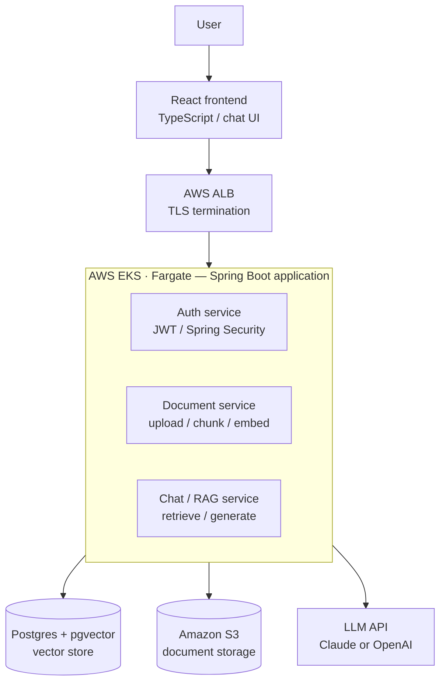

# Stage 2 — System Design

## Architecture

Request flow: a user goes through the React frontend and an AWS ALB into a single Spring Boot
application running on AWS EKS Fargate. That application contains three internal services (Auth,
Document, Chat/RAG) — not separate microservices, one deployable app with clear internal module
boundaries. It connects down to Postgres with pgvector, Amazon S3, and an external LLM API.

Supporting infra (provisioned separately, not part of the request path): Terraform for IaC,
Jenkins/GitHub Actions for CI/CD, Prometheus/Grafana for monitoring — covered in Stages 7 and 8.

## Database Schema (Phase 1)

| Table | Key columns |
|---|---|
| `users` | id (UUID PK), email (unique), password_hash, role (USER/ADMIN), created_at |
| `documents` | id (UUID PK), user_id (FK), filename, source_type, s3_key, status (PENDING/INDEXED/FAILED), uploaded_at |
| `chunks` | id (UUID PK), document_id (FK), chunk_index, content (text), embedding (vector(1536)), created_at |
| `chat_sessions` | id (UUID PK), user_id (FK), title, created_at |
| `chat_messages` | id (UUID PK), session_id (FK), role (USER/ASSISTANT), content, cited_chunk_ids (jsonb), created_at |
| `refresh_tokens` | id (UUID PK), user_id (FK), token_hash, expires_at, revoked (bool) |

Relationships: one user → many documents → many chunks; one user → many chat sessions → many messages.

Phase 2 additions (multi-tenant): `workspaces`, `workspace_members` (user_id, workspace_id, role);
`documents.workspace_id` replaces `user_id` for resource scoping.

## API Contract

| Endpoint | Purpose |
|---|---|
| `POST /api/auth/register` | Create account |
| `POST /api/auth/login` | Returns access token; refresh token set as httpOnly cookie |
| `POST /api/auth/refresh` | Rotate access token using the cookie |
| `POST /api/auth/logout` | Revoke refresh token |
| `POST /api/documents` | Upload a document (multipart) — kicks off async ingestion |
| `GET /api/documents` | List a user's documents + status |
| `GET /api/documents/{id}` | Get a single document's detail |
| `DELETE /api/documents/{id}` | Remove a document (and its chunks) |
| `GET /api/documents/{id}/status` | Poll ingestion status |
| `POST /api/chat/sessions` | Start a new chat session |
| `GET /api/chat/sessions` | List a user's chat sessions |
| `GET /api/chat/sessions/{id}/messages` | Get message history |
| `POST /api/chat/sessions/{id}/messages` | Ask a question → runs RAG → returns answer + citations |
| `GET /actuator/health` | Health check |
| `GET /actuator/prometheus` | Metrics scrape endpoint |

## RAG Pipeline Design

**Chunking** — recursive splitter, ~500–800 tokens per chunk with ~10–15% overlap, splitting on
paragraph/section boundaries rather than arbitrary character counts. Each chunk is tagged with
`document_id` and `source_type`.

**Embeddings** — a 1536-dim embedding model (e.g. OpenAI's `text-embedding-3-small`, or Voyage AI),
stored in pgvector with an HNSW index for fast approximate nearest-neighbor search.

**Ingestion** — runs async on upload (Spring `@Async` or a lightweight queue) so the upload request
returns immediately while `document.status` updates as chunking/embedding completes.

**Retrieval** — cosine similarity search via pgvector's `<=>` operator, top_k = 5, with an optional
hybrid pass using Postgres full-text search so exact terms (error codes, alert names) aren't missed
by pure vector similarity.

**Prompt construction** — a system prompt instructing the model to answer only from the provided
context, cite its source, and say "I don't know" when context is insufficient. Retrieved chunks are
labeled by source and inserted before the user's question, and are always treated as data, never as
instructions (this is the prompt-injection defense from the security plan applied concretely).
